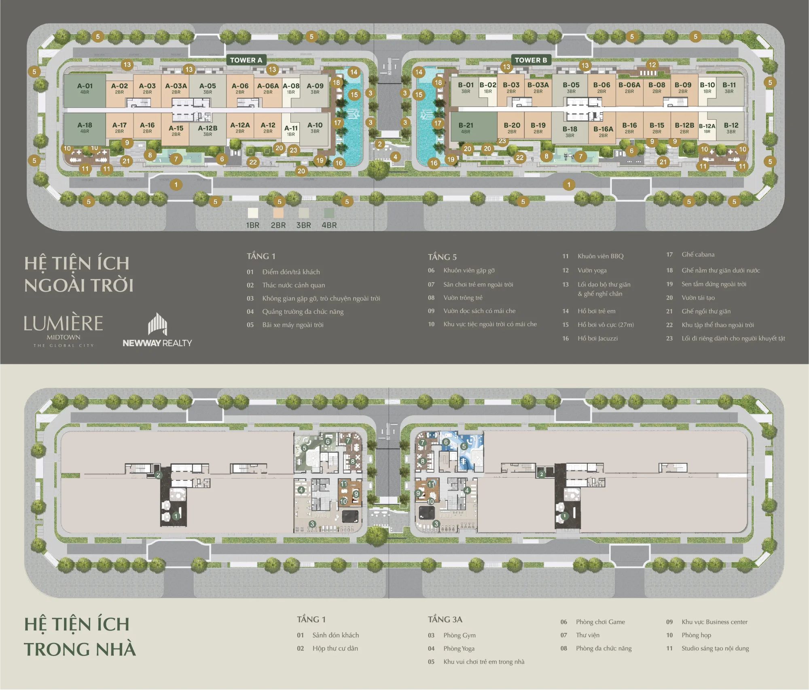

Lumière Midtown (phân khu CT4) kết hợp nhịp sống năng động của một trung tâm kinh tế mới với sự riêng tư của một tổ ấm cao cấp, kế thừa triết lý thiết kế bền vững chung của The Global City.

### 1. Vị trí "trái tim" đại đô thị

- Toạ lạc tại phân khu CT4, phường An Phú, TP. Thủ Đức
- Tầm nhìn hướng ra hệ thống kênh đào nhạc nước và công viên cây xanh

### 2. Kiến trúc và quy hoạch xanh

- **Thiết kế bởi Foster + Partners:** chú trọng đón ánh sáng tự nhiên và thông gió
- **Mật độ xây dựng thấp:** mật độ khối tháp chỉ khoảng 24,8%
- **Quy mô:** 2 tòa tháp cao 25 tầng, giới hạn 808 căn hộ

### 3. Sản phẩm đa dạng

- 1PN ~54 m²; 2PN 77 - 81 m²; 3PN ~99 m²; 4PN ~128 m²; Penthouse lên đến 244 m²

### 4. Hệ sinh thái tiện ích

- **Nội khu:** hồ bơi vô cực, phòng gym chuẩn quốc tế, khu vui chơi trẻ em, sảnh đón chuẩn 5 sao
- **Ngoại khu:** thừa hưởng Trung tâm thương mại hạng A 123.000 m², trường học quốc tế và bệnh viện của The Global City

## Thông tin tổng quan

| Thông tin | Chi tiết |
| --- | --- |
| Tên dự án | Lumière Midtown |
| Vị trí | Đường Đỗ Xuân Hợp (phân khu CT4), Khu đô thị The Global City |
| Chủ đầu tư | Masterise Homes |
| Tổng diện tích | 1,65 ha |
| Tổng số căn | 808 căn |
| Mật độ xây dựng | 35% |
| Dự kiến bàn giao | 2027 |
| Nhà thầu chính | Newteccons |
| Loại dự án | Dự án cao tầng |
| Loại hình sản phẩm | 1PN, 2PN, 3PN, 4PN, Duplex, Penthouse |

## Mặt bằng tổng quan

## Mặt bằng tầng
