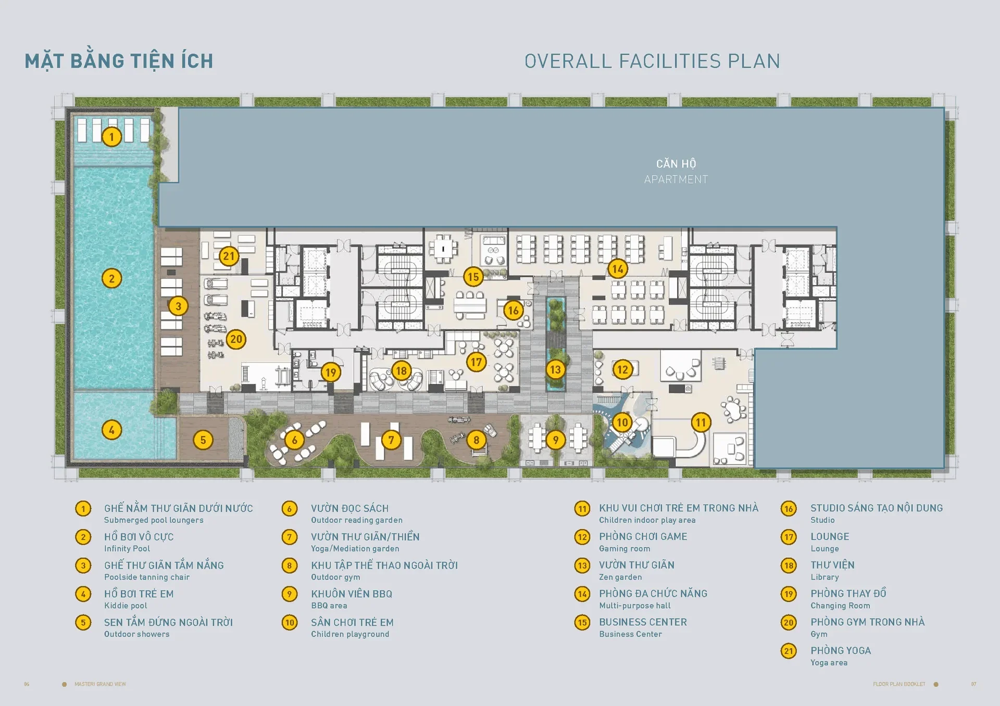

Masteri Grand View là phân khu cao tầng đầu tiên ra mắt tại The Global City, định vị theo tiêu chuẩn sống hiện đại và cao cấp.

### 1. Kiến trúc

- **Thiết kế bởi Foster + Partners:** ngôn ngữ kiến trúc đương đại, chú trọng tính bền vững và thẩm mỹ
- **100% căn góc:** toàn bộ căn hộ được thiết kế dạng căn góc, tối ưu ánh sáng tự nhiên và thông gió
- **Tầm nhìn toàn cảnh:** hệ kính cao kịch trần hướng ra khu nhạc nước và trung tâm thành phố

### 2. Quy mô và sản phẩm

- **Số lượng tòa:** 2 tòa tháp Spark và Glow, cao 25 tầng
- **Tổng số căn:** 616 căn hộ và 27 căn shophouse khối đế
- **Diện tích:** 1PN ~56,6 m²; 2PN 76,8 - 84,4 m²; 3PN 113,7 - 136,6 m²; 4PN ~180,8 m²; Penthouse lên đến 372,2 m²

### 3. Vị trí và kết nối

- Nằm tại giao điểm giữa đường Liên Phường và đường Đỗ Xuân Hợp
- Cách Trung tâm thương mại hạng A 123.000 m² và khu nhạc nước lớn nhất Đông Nam Á chỉ vài bước chân

### 4. Tiện ích đặc quyền

- **Nội khu chuẩn 5 sao:** sảnh đón, hồ bơi vô cực, phòng gym, khu vui chơi trẻ em riêng biệt
- **Không gian xanh:** mật độ xây dựng khối tháp chỉ khoảng 24,5%, phần lớn diện tích dành cho cảnh quan

## Thông tin tổng quan

| Thông tin | Chi tiết |
| --- | --- |
| Tên dự án | Masteri Grand View |
| Vị trí | Đường Đỗ Xuân Hợp, Khu đô thị The Global City |
| Chủ đầu tư | Masterise Homes |
| Tổng số căn | 616 căn hộ + 27 shophouse |
| Mật độ xây dựng | 24,5% (khối tháp) |
| Dự kiến bàn giao | 2026 |
| Nhà thầu chính | Tung Feng, Central, Delta, An Phong |
| Loại dự án | Dự án cao tầng |
| Loại hình sản phẩm | 1PN, 2PN, 3PN, 4PN, Penthouse |

## Mặt bằng tổng quan

## Mặt bằng tầng
