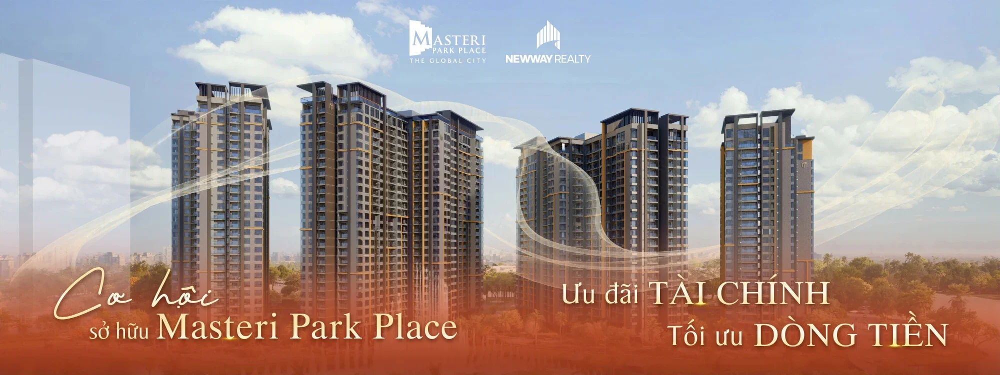
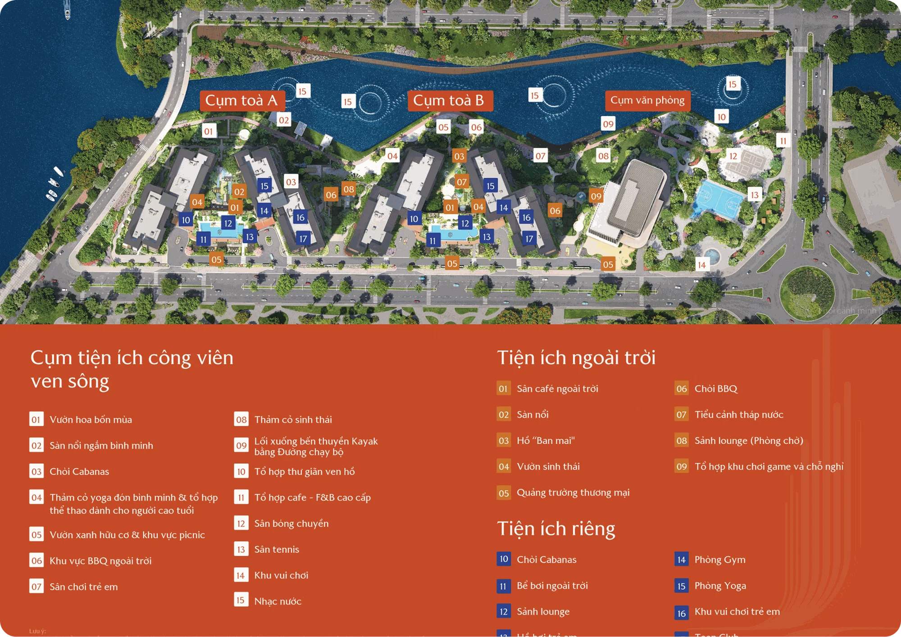

Masteri Park Place (CT5) là phân khu căn hộ cao tầng hạng sang thuộc siêu tổ hợp The Global City, tọa lạc tại tâm điểm phường An Phú, TP. Thủ Đức - nơi không gian xanh bền vững hòa quyện cùng kiến trúc đương đại đẳng cấp thế giới.

### 1. Vị trí chiến lược

- Tọa lạc tại Khu đô thị The Global City, mặt tiền đường Đỗ Xuân Hợp - trung tâm kết nối của TP.HCM
- Ba mặt hướng sông và kênh đào, sở hữu cảnh quan mặt nước hiếm có giữa lòng đô thị

### 2. Kiến trúc đẳng cấp

- **Thiết kế bởi Foster + Partners:** đơn vị kiến trúc danh tiếng hàng đầu thế giới, tối ưu hóa trải nghiệm sống cho cư dân
- **Quy mô:** 4 tòa tháp A1, A2, B1, B2, giới hạn 1.728 căn hộ
- **Mật độ xây dựng:** khoảng 25%, dành phần lớn diện tích cho công viên và mặt nước

### 3. Quy mô sản phẩm

- 1PN 50,9 - 56,0 m²; 1PN+ 52,8 - 57,2 m²; 2PN 72,0 - 81,0 m²; 3PN 91,5 - 110,0 m²; 4PN 120,0 - 135,0 m²; Duplex 109,6 - 132,5 m²; Penthouse 231,0 - 247,0 m²

### 4. Tiện ích đặc quyền

- **Cụm công viên ven sông:** vườn hoa bốn mùa, chòi cabanas, bến thuyền Kayak, sân tennis, sân bóng chuyền
- **Tiện ích riêng:** sảnh lounge chuẩn 5 sao, bể bơi ngoài trời, phòng Gym, phòng Yoga, khu vui chơi trẻ em, Teen Club, thư viện

## Thông tin tổng quan

| Thông tin | Chi tiết |
| --- | --- |
| Tên dự án | Masteri Park Place |
| Vị trí | Khu đô thị The Global City (phân khu CT5), Đường Đỗ Xuân Hợp |
| Chủ đầu tư | Masterise Homes |
| Tổng diện tích | 2,46 ha |
| Tổng số căn | 1.728 căn |
| Mật độ xây dựng | 25% |
| Dự kiến bàn giao | 2028 |
| Loại dự án | Dự án cao tầng |
| Loại hình sản phẩm | 1PN, 1PN+, 2PN, 3PN, 4PN, Duplex, Penthouse |

## Mặt bằng tổng quan

## Mặt bằng tầng
