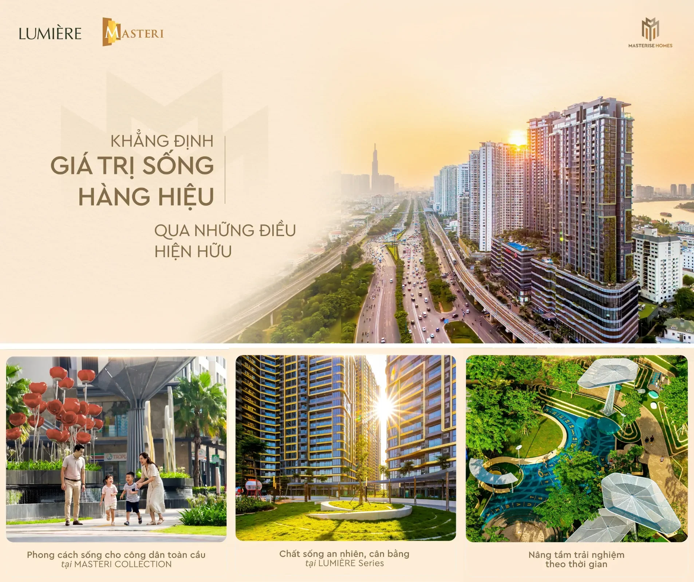

Với Masterise Homes, giá trị sống hàng hiệu không chỉ nằm ở các tiêu chuẩn quốc tế hay chất lượng của một không gian sống, mà là cả một triết lý kiến tạo trải nghiệm được chăm chút xuyên suốt - từ khi một ngôi nhà bắt đầu hình thành cho đến khi nơi ấy thực sự trở thành chốn để trở về mỗi ngày.

Cảnh quan và hệ tiện ích được gìn giữ qua thời gian, không gian chung nuôi dưỡng sự kết nối cộng đồng, chất lượng vận hành mang lại sự an tâm mỗi ngày - chính những yếu tố này giúp các tiêu chuẩn đặt ra từ ban đầu trở thành giá trị sống có thể cảm nhận được và bền vững theo năm tháng.

Tại các dự án đã bàn giao của Masterise Homes, những tiêu chuẩn được đặt ra từ ngày đầu phát triển đang từng bước được kiểm chứng bằng chính trải nghiệm thực tế của cộng đồng cư dân. Từ chất lượng không gian, cảnh quan, hệ tiện ích cho đến dịch vụ quản lý vận hành, mỗi yếu tố cùng góp phần tạo nên một môi trường sống đã hiện hữu và vẫn tiếp tục được bồi đắp theo thời gian.

Ở phân khúc dành cho những chủ nhân tinh anh, LUMIÈRE Series tiếp tục định hình một chất sống riêng - nơi thiên nhiên, sự cân bằng và những trải nghiệm chăm chút cùng hội tụ để tạo nên những khoảng lặng thư thái, tái tạo thân - tâm - trí giữa nhịp sống đô thị. Qua từng không gian và điểm chạm được chắt lọc kỹ lưỡng, mỗi cư dân có thể tận hưởng một phong cách sống mang dấu ấn cá nhân, xứng tầm với những giá trị mà mình theo đuổi.

Ở một hướng tiếp cận khác, các dự án thuộc Masteri Collection hướng đến phong cách sống của những công dân toàn cầu, nơi nhịp sống năng động song hành cùng các kết nối ý nghĩa giữa gia đình, cộng đồng và con người đô thị. Hệ tiện ích đa dạng cùng không gian cộng đồng mở ra nhiều lựa chọn trải nghiệm, giúp mỗi cư dân chủ động cân bằng giữa sự nghiệp, cuộc sống và tận hưởng, đồng thời vun đắp những gắn kết cảm xúc ý nghĩa mỗi ngày.

Những giá trị này không dừng lại ở thời điểm bàn giao mà tiếp tục được cảm nhận và bồi đắp theo thời gian. Với Masterise Homes, bàn giao một ngôi nhà chưa bao giờ là điểm kết thúc của hành trình kiến tạo giá trị, mà là điểm khởi đầu cho những trải nghiệm sống bền vững - nơi giá trị thật được gìn giữ và không ngừng được nâng tầm.

Trên nền tảng những giá trị đã được kiểm chứng, chương trình "Đồng hành kiến tạo giá trị - Nâng tầm trải nghiệm sống bền vững" tiếp tục nối dài cam kết của Masterise Homes, mang đến các giải pháp giúp khách hàng thêm chủ động và an tâm trên hành trình kiến tạo tổ ấm và hoạch định tương lai dài hạn.
