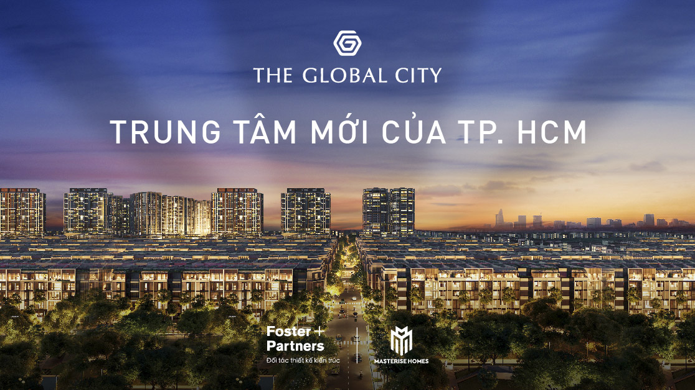
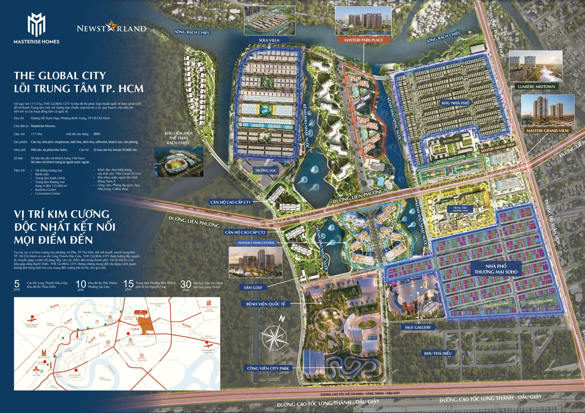

## THE GLOBAL CITY — ĐẠI ĐÔ THỊ QUỐC TẾ KIẾN TẠO "DOWNTOWN MỚI" CHO TP.HCM

Nằm dọc trục đường Song Hành – Đỗ Xuân Hợp thuộc phường An Phú, TP. Thủ Đức (khu vực trước đây là Quận 2), The Global City là dự án đô thị phức hợp do Masterise Homes làm chủ đầu tư, với đơn vị quy hoạch tổng thể là Foster + Partners — công ty kiến trúc hàng đầu thế giới đến từ Anh Quốc. Đây cũng là khu đô thị đầu tiên tại Việt Nam được quy hoạch bởi Foster + Partners.

### Vị trí

Dự án có bốn mặt tiếp giáp rõ ràng: phía Đông giáp đường Đỗ Xuân Hợp, phía Tây giáp khu đô thị Sài Gòn Sports City, phía Nam giáp cao tốc TP.HCM – Long Thành – Dầu Giây, phía Bắc giáp rạch Chiếc. Nhờ vị trí này, The Global City chỉ cách khu Thảo Điền khoảng 5 phút di chuyển, cách trung tâm Thủ Thiêm khoảng 10 phút, cách chợ Bến Thành 15–20 phút, và cách hai sân bay Tân Sơn Nhất và Long Thành (tương lai) khoảng 30 phút — một vị trí kết nối thuận tiện tới hầu hết các khu vực trọng điểm của TP.HCM.

### Thông số & quy mô

- **Tổng diện tích:** 117,4 ha
- **Mật độ xây dựng:** 28,5%
- **Mảng xanh và mặt nước:** khoảng 25% tổng diện tích
- **Khởi công:** 18/3/2021
- **Quy mô sản phẩm toàn khu:** khoảng 10.000 căn hộ cao tầng và gần 1.800 sản phẩm thấp tầng (nhà phố, shophouse, biệt thự)
- **Pháp lý:** khách hàng Việt Nam được cấp sổ hồng sở hữu lâu dài; khách nước ngoài sở hữu theo thời hạn 50 năm

### Tiện ích nổi bật

- Trung tâm thương mại quy mô 123.000 m², được giới thiệu là một trong những trung tâm thương mại lớn nhất Việt Nam
- Hệ thống nhạc nước "Fountain Bay" được quảng bá là lớn nhất Đông Nam Á
- Hệ thống trường học quốc tế đạt chuẩn quốc tế, đồng hành cùng cư dân từ bậc mầm non đến trung học phổ thông
- Bệnh viện quốc tế và hệ thống y tế hiện đại ngay trong nội khu, chăm sóc sức khỏe cư dân toàn diện
- Công viên trung tâm và mảng xanh dọc tuyến kênh rạch
- Hồ bơi vô cực, khu vui chơi trẻ em, phòng gym, không gian co-working
- Khối đế thương mại, shophouse dọc các tuyến phố đi bộ nội khu

### Tiềm năng và ý nghĩa quy hoạch

The Global City được định vị là "downtown mới" của TP.HCM, một mắt xích trong hành lang phát triển phía Đông thành phố — kết nối Thủ Thiêm, Thảo Điền, Cát Lái và hướng ra sân bay Long Thành trong tương lai. Với quy mô lớn, đơn vị quy hoạch quốc tế Foster + Partners và hệ tiện ích tích hợp đầy đủ từ thương mại, giải trí đến giáo dục, y tế, The Global City hướng đến việc kiến tạo một khu vực sống, làm việc và giải trí đẳng cấp quốc tế ngay trong lòng TP. Thủ Đức — góp phần định hình diện mạo đô thị mới cho TP.HCM trong tương lai.
