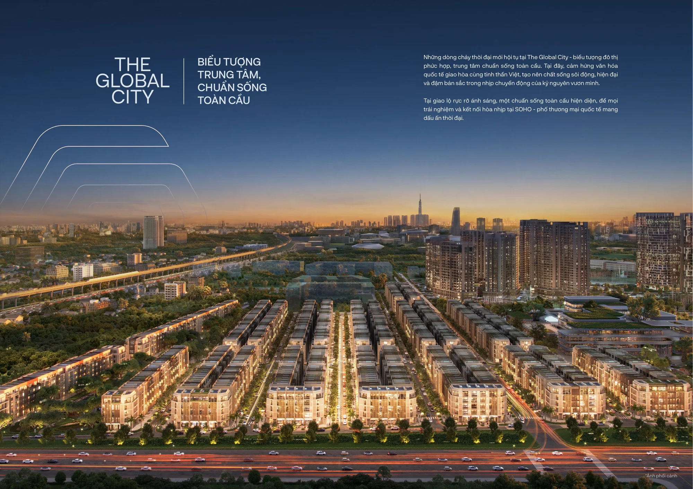
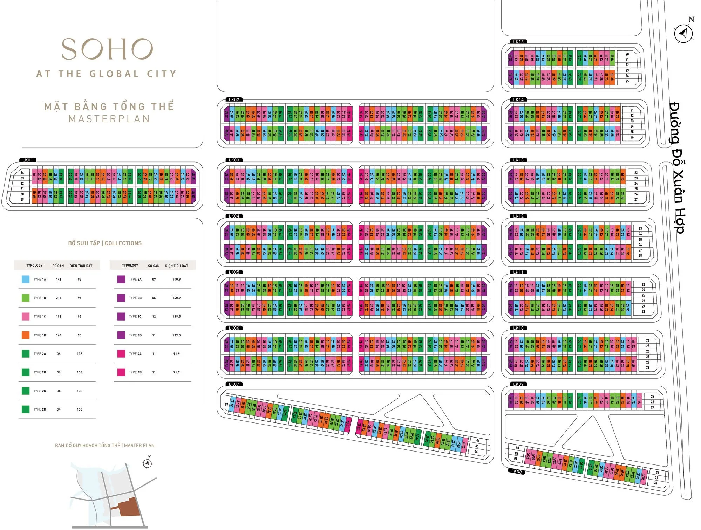

SOHO là phân khu nhà phố thương mại (shophouse) sôi động và sầm uất bậc nhất tại The Global City, toạ lạc ngay vị trí trung tâm của đại đô thị. Phân khu được thiết kế theo chuẩn mực quốc tế, hướng đến trở thành điểm đến mua sắm, ẩm thực và giải trí hàng đầu khu vực.

<video class="intro-video" src="/videos/soho-thiet-ke-doc-dao.mp4" controls autoplay muted loop playsinline></video>

### 1. Quy mô và quy hoạch

- **Tổng diện tích:** 13,5 ha
- **Số lượng sản phẩm:** 915 căn nhà phố thương mại
- **Phân chia khu vực:** bố trí thành 15 dãy (LK01 - LK15), xen kẽ các trục đường nội khu rộng thoáng và mảng xanh cảnh quan

### 2. Thiết kế kiến trúc độc bản

- **Thiết kế bởi Foster + Partners:** mỗi dãy nhà mang một ngôn ngữ thiết kế riêng biệt, kết hợp hài hoà giữa nét hiện đại và các yếu tố văn hoá đặc trưng
- **Quy chuẩn xây dựng:** kết cấu 1 trệt và 4 lầu, diện tích đất tiêu chuẩn khoảng 95 m² (5x19m)
- **Tối ưu kinh doanh:** mặt tiền linh hoạt với hệ cửa kính lớn và vỉa hè rộng, phù hợp trưng bày và kinh doanh đa dạng loại hình dịch vụ

### 3. Vị trí và kết nối

- Nằm ngay sát Trung tâm thương mại hạng A rộng 123.000 m² và khu nhạc nước lớn nhất Đông Nam Á
- Tiếp giáp các trục đường huyết mạch: đường Liên Phường và đường Đỗ Xuân Hợp
- Cách nút giao An Phú và cao tốc TP.HCM – Long Thành – Dầu Giây khoảng 5-10 phút di chuyển

### 4. Giá trị và tiềm năng

SOHO vận hành theo mô hình "all-in-one", tích hợp đầy đủ dịch vụ từ ăn uống, làm đẹp đến văn phòng làm việc. Với hệ tiện ích biểu tượng hiện diện xung quanh, SOHO sở hữu tiềm năng khai thác cho thuê và gia tăng giá trị tài sản.

## Thông tin tổng quan

| Thông tin | Chi tiết |
| --- | --- |
| Tên dự án | SOHO |
| Vị trí | Khu đô thị The Global City, mặt tiền đường Đỗ Xuân Hợp và cao tốc TP.HCM – Long Thành – Dầu Giây |
| Chủ đầu tư | Masterise Homes |
| Tổng diện tích | 13,5 ha |
| Tổng số căn | 915 căn |
| Mật độ xây dựng | 38% |
| Bàn giao | 2024, đã có sổ hồng |
| Nhà thầu chính | An Phong |
| Loại dự án | Dự án thấp tầng |
| Loại hình sản phẩm | Nhà phố thương mại 1A, 1B, 1C, 1D, 2A, 2B |

## Mặt bằng tổng quan

## Mặt bằng căn
