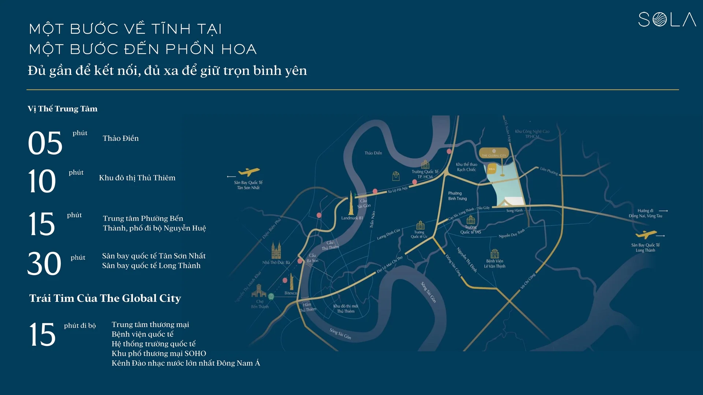
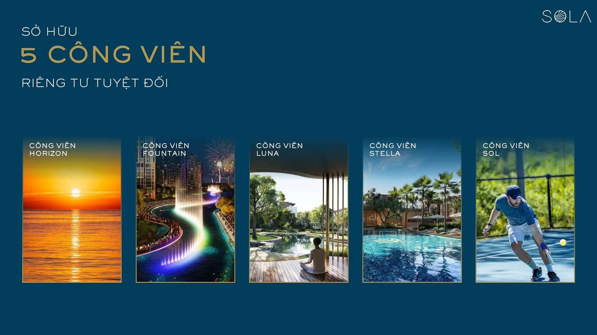
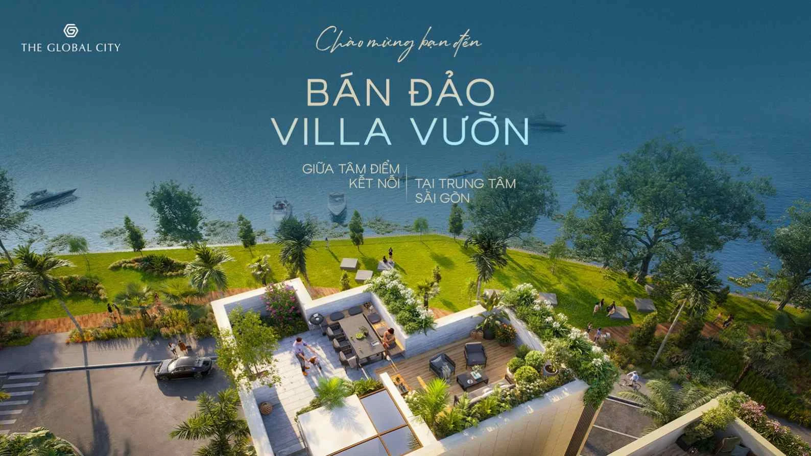
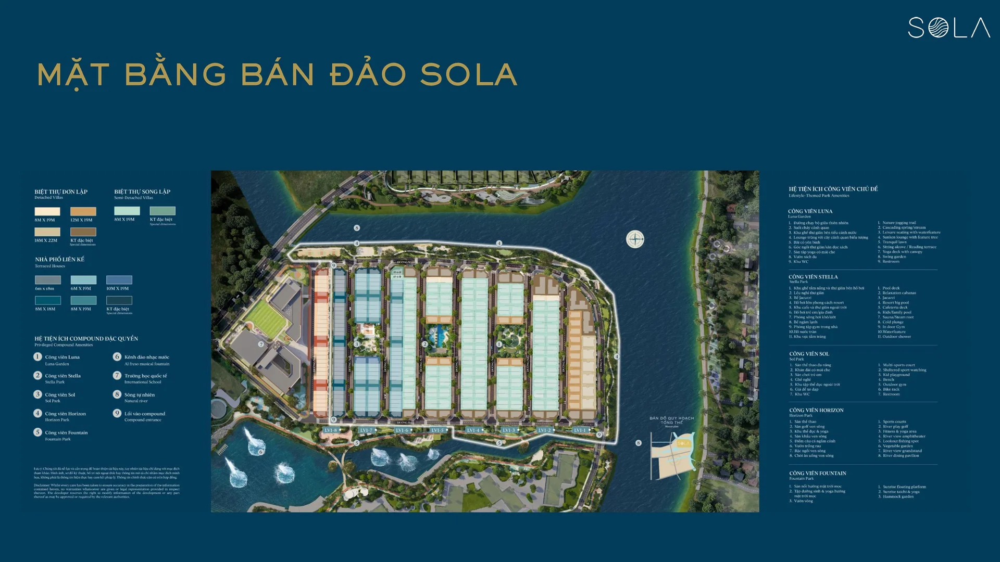

SOLA là phân khu thấp tầng dạng compound khép kín duy nhất tại The Global City, được định vị làm không gian nghỉ dưỡng riêng tư và tĩnh tại - đối lập với nhịp sống sôi động của khu nhà phố thương mại SOHO. Bán đảo SOLA sở hữu ba mặt giáp sông Rạch Chiếc và kênh đào The Canal of Love.

<iframe class="video-embed" src="https://www.youtube-nocookie.com/embed/WTvSWwi6JnQ" title="SOLA - The Global City" allow="accelerometer; autoplay; clipboard-write; encrypted-media; gyroscope; picture-in-picture" allowfullscreen loading="lazy"></iframe>

### 1. Quy mô và loại hình sản phẩm

- **Loại hình:** nhà phố liên kế vườn, biệt thự song lập, biệt thự đơn lập và Boutique Shop
- **Số lượng:** hơn 300 căn - quy mô giới hạn để giữ tính khan hiếm cho dòng sản phẩm cao cấp

### 2. Thiết kế kiến trúc

- **Thiết kế bởi Foster + Partners:** cùng ngôn ngữ thiết kế chung của The Global City nhưng mang bản sắc riêng, thiên về màu sắc đương đại và sự hoà hợp với thiên nhiên
- **Không gian xanh:** các căn biệt thự đan xen với mảng xanh và hệ thống kênh đào, tạo thành một khu sinh thái biệt lập giữa lòng đô thị

### 3. Vị trí và kết nối

- Cách khu đô thị Thảo Điền khoảng 5 phút, khu đô thị Thủ Thiêm khoảng 10 phút
- Cách trung tâm Bến Thành, phố đi bộ Nguyễn Huệ khoảng 15 phút
- Cách sân bay Tân Sơn Nhất và sân bay quốc tế Long Thành (tương lai) khoảng 30 phút
- Chỉ khoảng 15 phút đi bộ tới trung tâm thương mại, bệnh viện quốc tế, hệ thống trường quốc tế, khu phố thương mại SOHO và kênh đào nhạc nước lớn nhất Đông Nam Á

### 4. Tiện ích đặc quyền

- **Cảnh quan mặt nước:** ba mặt bao bọc bởi kênh đào nhạc nước, công viên và sông Rạch Chiếc
- **An ninh khép kín:** quy hoạch theo mô hình compound riêng tư, an ninh 24/7
- **Hệ thống công viên nội khu:** 5 công viên chủ đề - Horizon, Fountain, Luna, Stella, Sol - phục vụ nhu cầu thư giãn, thể thao và kết nối cộng đồng cư dân

## Thông tin tổng quan

| Thông tin | Chi tiết |
| --- | --- |
| Tên dự án | SOLA |
| Vị trí | Khu đô thị The Global City, đường Đỗ Xuân Hợp |
| Chủ đầu tư | Masterise Homes |
| Tổng diện tích | 9,86 ha |
| Tổng số căn | 369 căn |
| Mật độ xây dựng | 25,1% |
| Dự kiến bàn giao | 01/2027 |
| Nhà thầu chính | Coteccons |
| Loại dự án | Dự án thấp tầng |
| Loại hình sản phẩm | Nhà phố liên kế vườn, Biệt thự song lập, Biệt thự đơn lập, Boutique Shop |

## Mặt bằng tổng quan

## Mặt bằng căn
